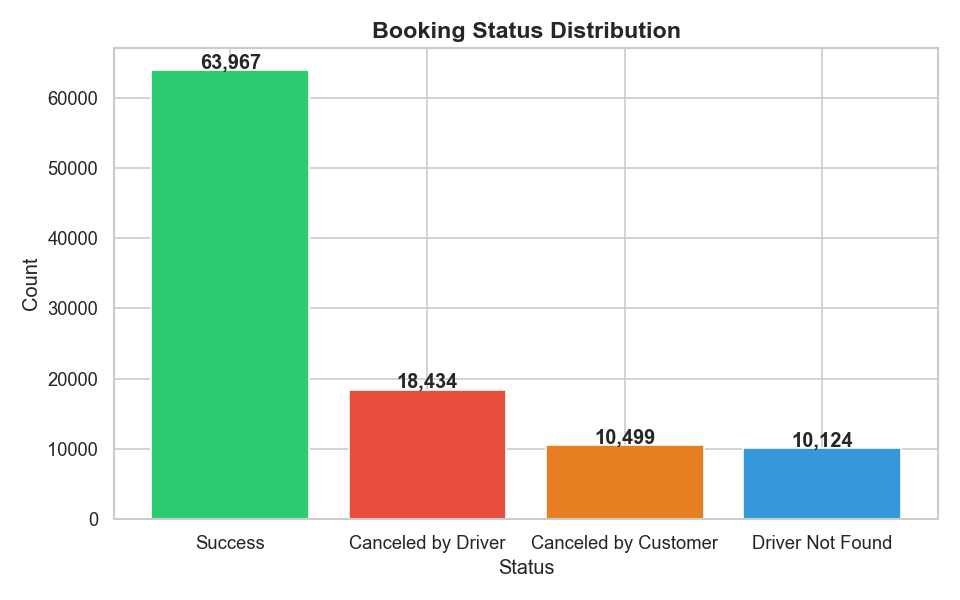
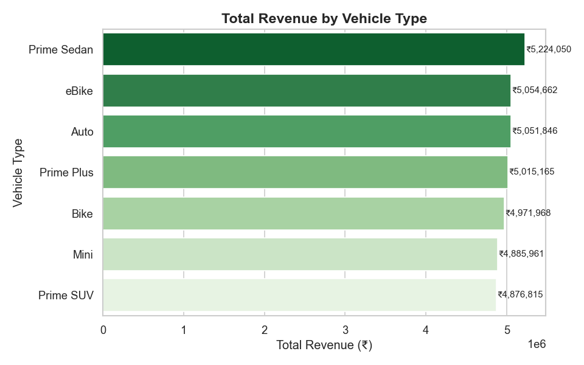
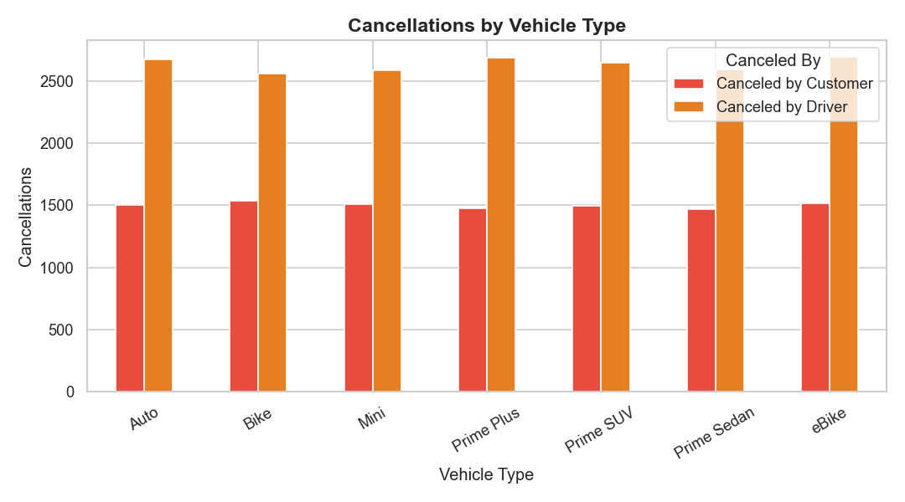
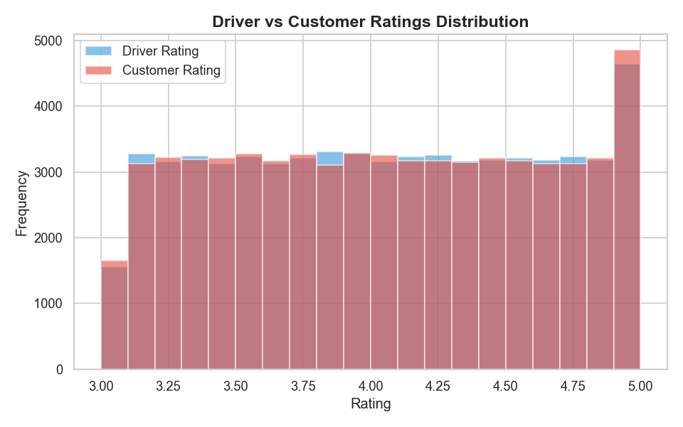

# 🚕 Ola Ride Booking Data Insights & Business Intelligence Dashboard

A complete end-to-end data analytics project on Ola ride booking data — covering raw data ingestion, Python-based cleaning, SQLite-based SQL analysis, Python visualisations, and an interactive Power BI dashboard.

---

## 📌 Project Overview

This project analyses ride booking data for **July 2024** across vehicle types, pickup/drop locations, payment methods, and customer behaviour. The goal was to uncover operational trends, identify cancellation patterns, and present business insights through a professional BI dashboard.

**Dataset: 103,024 bookings | 23 columns | 7 vehicle types | 1 month**

---

## 🛠️ Tools & Technologies

| Layer | Tool |
|---|---|
| Data Cleaning | Python (Pandas) |
| Exploratory Analysis | Python (Pandas) |
| Database & SQL | SQLite (via Python) |
| Visualisation (Python) | Matplotlib, Seaborn |
| Visualisation (BI) | Power BI Desktop |
| IDE | VS Code / Jupyter Notebook |

---

## 📁 Project Structure

```
Ola-Ride-Analysis/
│
├── bookings.xlsx                  # Original raw dataset
├── cleaned_bookings.csv           # Final cleaned dataset
│
├── understand_data.py             # Initial data exploration
├── clean_data.py                  # Data cleaning pipeline
├── eda.py                         # Exploratory data analysis
├── sql_analysis.py                # SQL queries via SQLite
├── charts.py                      # Python visualisations (8 charts)
│
├── chart1_booking_status.png
├── chart2_vehicle_type.png
├── chart3_revenue_by_vehicle.png
├── chart4_payment_method.png
├── chart5_hourly_bookings.png
├── chart6_daily_revenue.png
├── chart7_cancellations.png
├── chart8_ratings.png
│
├── Ola_Analysis.pbix              # Power BI dashboard file
│
└── README.md
```

---

## 🔄 Project Workflow

```
Raw Excel → Python Cleaning → cleaned_bookings.csv → SQL Analysis → Python Charts → Power BI Dashboard
```

### Step 1 — Data Understanding (`understand_data.py`)
- Explored shape, column names, data types, and basic statistics
- Identified null values and columns requiring cleaning
- Raw dataset: 103,024 rows × 24 columns

### Step 2 — Data Cleaning (`clean_data.py`)
- Dropped `Vehicle Images` column (100% empty)
- Filled nulls with logical values — cancelled rides have no payment/rating, which is valid
- Converted `Date` column to proper datetime format
- Engineered new columns: `Day`, `DayOfWeek`, `Hour`, `Time_Period` (Morning/Afternoon/Evening/Night)
- Final dataset: 103,024 rows × 23 columns — zero nulls

### Step 3 — Exploratory Data Analysis (`eda.py`)
- Booking status breakdown with percentages
- Vehicle type popularity ranking
- Revenue analysis — total, average, max, min
- Payment method distribution
- Peak hour identification
- Cancellation analysis — customer vs driver
- Ratings analysis — driver vs customer
- Ride distance statistics

### Step 4 — SQL Analysis (`sql_analysis.py`)
- Loaded cleaned data into SQLite database
- Ran 10 structured queries covering:
  - Overall summary (bookings, revenue, avg distance)
  - Booking status breakdown
  - Revenue by vehicle type
  - Payment method usage
  - Top 5 pickup and drop locations
  - Cancellations by vehicle type
  - Peak hours
  - Ratings by vehicle type
  - Daily revenue trend

### Step 5 — Python Visualisations (`charts.py`)
Generated 8 publication-ready charts using Matplotlib and Seaborn:

| Chart | Type | Insight |
|---|---|---|
| Booking Status Distribution | Bar Chart | Success vs cancellation split |
| Vehicle Type Popularity | Horizontal Bar | Most booked vehicle types |
| Revenue by Vehicle Type | Horizontal Bar | Revenue contribution per type |
| Payment Method Distribution | Pie Chart | How customers pay |
| Bookings by Hour of Day | Line + Area | Demand pattern across 24 hours |
| Daily Revenue Trend | Line + Area | Revenue fluctuation in July 2024 |
| Cancellations by Vehicle Type | Grouped Bar | Driver vs customer cancellations |
| Driver vs Customer Ratings | Histogram | Rating distribution comparison |

### Step 6 — Power BI Dashboard (`Ola_Analysis.pbix`)
Built a 5-page interactive dashboard with slicers for Vehicle Type, Booking Status, and Time Period:

| Page | Visuals |
|---|---|
| Executive Dashboard | KPI cards, Booking Status donut, Vehicle popularity, Payment method bar |
| Revenue Analysis | Daily trend line, Revenue by vehicle, Top pickup locations treemap, Top routes table |
| Ride Patterns | Hourly area chart, Day of week bar, Time period donut, Avg distance KPI |
| Cancellations | 3 KPI cards, Cancellations by vehicle stacked bar, Incomplete ride reasons pie |
| Ratings | Avg rating KPIs, Ratings by vehicle clustered bar, Rating trend line |

---

## 📊 Key Findings

- **Total Bookings:** 103,024 | **Total Revenue:** ₹35M (successful rides only)
- **Success Rate:** 62.1% — meaning ~38% of all bookings did not complete
- **Average Booking Value:** ₹548.75 per successful ride
- **Average Ride Distance:** 22.85 km
- **Prime Sedan** is the most popular vehicle and highest revenue generator
- **Drivers cancel more (18,434)** than customers (10,499) — a key operational concern
- **Driver Not Found** accounts for 10,124 lost bookings — supply-demand gap
- **Cash dominates** at 54.8% of payments, followed by UPI at 40.5%
- **Ratings are uniformly distributed** between 3.0–5.0 for both drivers and customers
- **Bookings are evenly spread** across all 24 hours — no strong peak hour

---

## 📸 Dashboard Preview

### Booking Status Distribution


### Revenue by Vehicle Type


### Cancellations by Vehicle Type


### Driver vs Customer Ratings


---

## ▶️ How to Run

### 1. Clone the repo
```bash
git clone https://github.com/shyam-0121/Ola-Ride-Analysis.git
cd Ola-Ride-Analysis
```

### 2. Install dependencies
```bash
pip install pandas matplotlib seaborn openpyxl
```

### 3. Run in order
```bash
python understand_data.py
python clean_data.py
python eda.py
python sql_analysis.py
python charts.py
```

### 4. Open the dashboard
- Open `Ola_Analysis.pbix` in Power BI Desktop

---

## 👤 Author

**Ghanashyam Kumbhar**  
BCA | Shivaji University, Kolhapur (2023–2026)  
📧 shyamkumbhar9816@gmail.com  
🔗 [LinkedIn](https://www.linkedin.com/in/shyamkumbhar01)  
🐙 [GitHub](https://github.com/shyam-0121)
